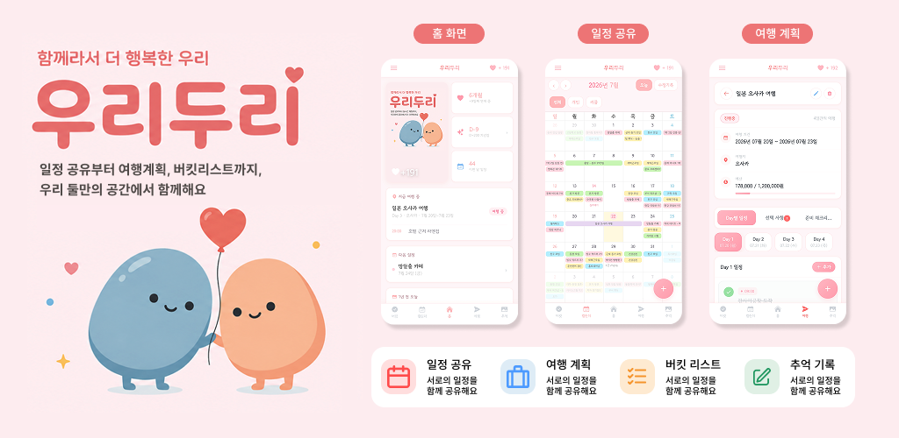
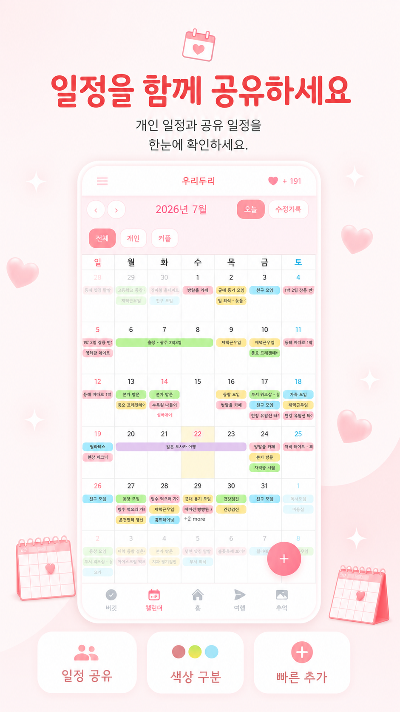
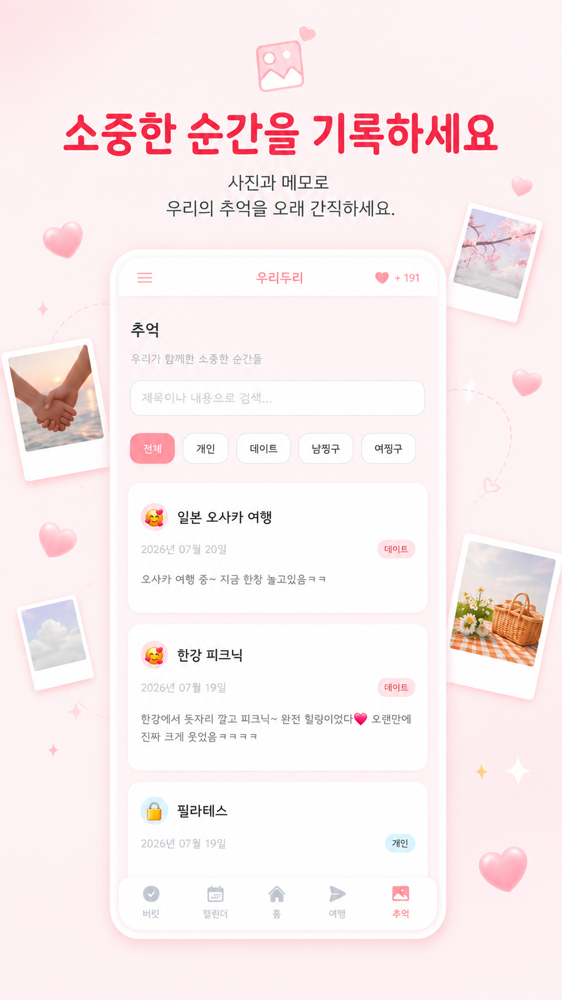
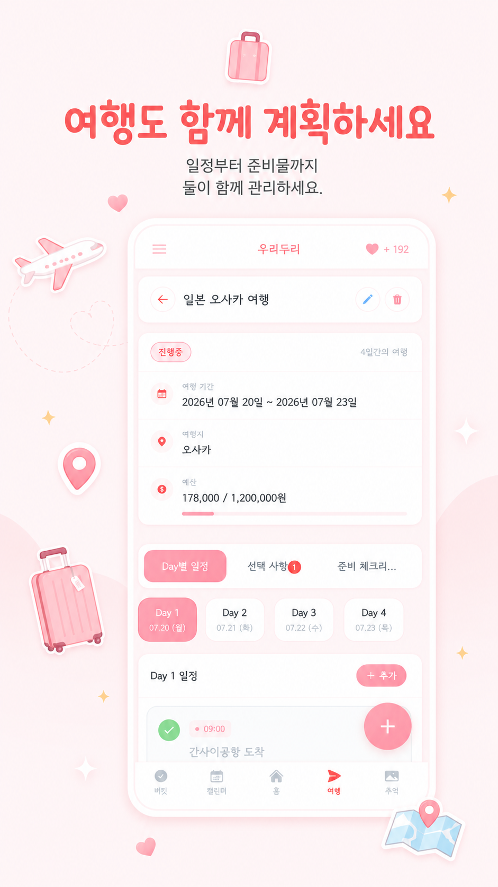
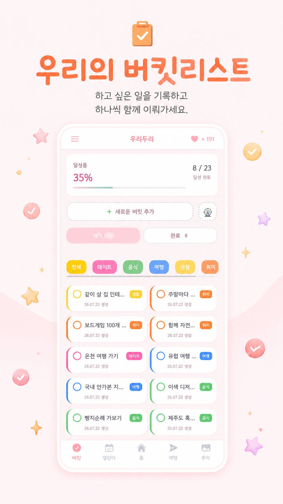
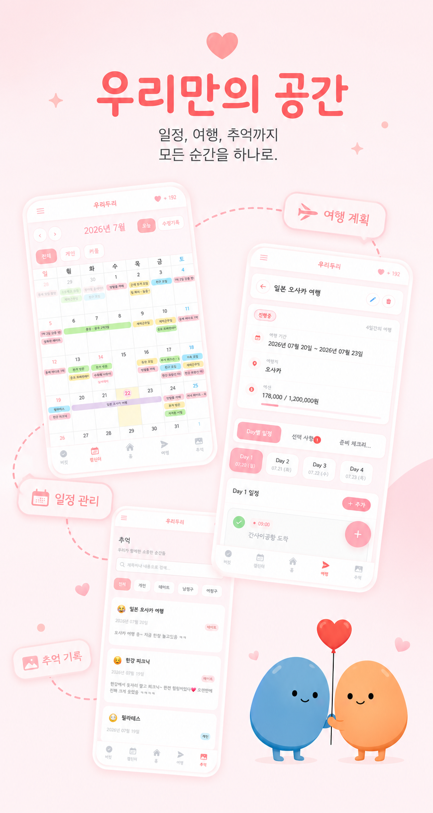

# 💛 우리두리 (Twogether)

> **우리 둘의 일상을 하나로, 연애는 더 편하게.**

[](https://github.com/ganglike248/Twogether)
[](https://firebase.google.com/)
[](https://react.dev/)
[](#)
[](https://twogether-206fb.web.app)

**🔗 Live Demo:** https://twogether-206fb.web.app

<p align="center">
  
</p>

---

# 💑 연애가 더 편해지는 방법

연애가 어려운 이유는 감정이 아니라 **놓치는 것들이 많기 때문입니다.**

> "이번 주 언제 시간 돼?"\
> "우리 다음 기념일이 언제였지?"\
> "지난 여행에서 뭐 했더라?"\
> "오늘은 뭐 하지?"\
> "우리 저번 기념일엔 뭐 했었지?"

이런 사소한 고민들이 쌓이면 연애도 조금씩 번거로워집니다.

**우리두리(Twogether)**는 커플의 **일정, 추억, 여행**을 하나로 연결하여
**더 편하고, 더 즐거운 연애**를 만들어 주는 커플 라이프 앱입니다.

---

# ✨ 함께하는 모든 순간을 하나로

<p align="center">
  
</p>

## 📅 함께 보는 공유 캘린더

이제 서로의 일정을 일일이 물어보지 않아도 됩니다.

- 🙋 나의 일정
- 👫 파트너의 일정
- 💑 함께하는 데이트 일정
- 🔒 나만 볼 수 있는 개인 일정

하나의 캘린더에서 모두 확인할 수 있어 약속을 잡는 시간이 훨씬
줄어듭니다.

개인 일정은 상대에게 보이지 않아 사생활은 지키면서 필요한 정보만 공유할
수 있습니다.

<p align="center">
  
</p>

---

## ❤️ 기념일을 잊지 않는 연애

오늘이 우리 몇 일째인지,

다음 기념일까지 얼마나 남았는지 한눈에 확인하세요.

소중한 날을 놓치지 않고, 매일의 시간을 더욱 특별하게 만들어 줍니다.

---

## 📸 추억을 차곡차곡 기록하세요

데이트, 여행, 특별했던 하루.

우리두리는 함께한 시간을 기록하고 검색을 통해 다시 꺼내볼 수 있는 공간을
제공합니다.

시간이 지날수록 단순한 일정표가 아니라,

우리의 사소한 하루들이 쌓여 만들어지는

**둘만의 추억 타임라인**이 완성됩니다.

<p align="center">
  
</p>

---

## ✈️ 여행 준비도 함께

여행 계획을 세우기 위해 메신저와 메모장을 오갈 필요가 없습니다.

- 여행 후보 비교
- 각 장소 점수 매기기
- Day별 일정 관리
- 여행 일정 자동 연동

여행 전부터 여행이 끝나는 순간까지 둘의 여행을 더욱 편리하게 만들어
줍니다.

<p align="center">
  
</p>

---

## 🎯 함께 이루는 버킷리스트

> "언젠가 같이 해보자."

말로만 끝났던 계획들을 버킷리스트에 저장하고 하나씩 실천해 보세요.

작은 목표를 함께 이루는 과정이 더 큰 추억으로 이어집니다.

<p align="center">
  
</p>

---

## 🎲 오늘 데이트는 뭘 할까?

저녁 메뉴나 데이트 장소를 정하지 못해 고민된다면?

돌림판 기능으로 재미있게 결정해 보세요.

사소한 선택도 즐거운 추억이 됩니다.

---

## ⚡ 빠르고 간편하게

우리두리는 **PWA(Web App)** 기반으로 제작되어 설치 없이 바로 사용할 수
있습니다.

홈 화면에 추가하면 일반 앱처럼 더욱 편리하게 이용할 수 있습니다.

---

# 💑 우리두리가 필요한 이유

- ✔ 서로의 일정을 한눈에 확인하고 싶다면
- ✔ 기념일을 잊지 않고 챙기고 싶다면
- ✔ 여행 계획을 함께 세우고 싶다면
- ✔ 추억을 오래도록 기록하고 싶다면
- ✔ 더 편하고 즐거운 연애를 하고 싶다면

**우리두리(Twogether)**가 함께합니다.

---

# 💛 둘이 함께하는 모든 순간을 하나의 공간에.

> 오늘의 약속부터,\
> 내일의 여행,\
> 그리고 평생 기억할 추억까지.

**우리두리(Twogether)**

<p align="center">
  
</p>

---

## 설치 없이 바로 사용하기

우리두리는 웹앱이라 별도 설치가 필요 없어요.

1. https://twogether-206fb.web.app 접속
2. 회원가입 후 **초대 코드를 생성**해서 파트너에게 공유
3. 파트너가 코드 입력하면 커플 연결 완료 ✓

> 📱 **스마트폰 홈 화면에 추가하면 앱처럼 사용**할 수 있어요.
> Safari(iOS): 공유 버튼 → 홈 화면에 추가 / Chrome(Android): 메뉴 → 앱 설치

---

## 기술 스택

### Frontend

| 기술               | 버전   | 선택 이유                                                                               |
| ------------------ | ------ | --------------------------------------------------------------------------------------- |
| **React**          | 19     | Concurrent Features + `React.lazy()` 코드 스플리팅으로 초기 번들 93% 감소               |
| **Vite**           | 5.4.21 | esbuild 기반 빠른 HMR, `manualChunks`로 vendor 청크 분리. Node.js 20 호환 버전으로 고정 |
| **React Router**   | 7      | `createBrowserRouter` + SPA 라우팅. `/travel/:tripId` 동적 라우트                       |
| **Framer Motion**  | 12     | 100일 기념 마일스톤 등 의미있는 순간에 절제하여 사용                                    |
| **FullCalendar**   | 6      | 커스텀 그리드 렌더링·터치 스와이프 네비게이션을 지원하는 검증된 달력 라이브러리         |
| **date-fns**       | 4      | Tree-shakeable, moment.js 대비 번들 크기 대폭 절감                                      |
| **react-icons**    | 5      | SVG 아이콘 Tree-shaking 지원                                                            |
| **react-toastify** | 11     | 비침투적 알림 UX                                                                        |

### Backend / 인프라

| 기술                   | 선택 이유                                                                                    |
| ---------------------- | -------------------------------------------------------------------------------------------- |
| **Firebase Auth**      | 이메일 인증 + 추후 소셜 로그인 확장 대비. 별도 서버 없이 인증 플로우 완성                    |
| **Cloud Firestore**    | `onSnapshot` 실시간 구독으로 파트너 변경사항 즉시 반영. `writeBatch`로 원자적 다중 문서 처리 |
| **Firebase Storage**   | 커플 대표 이미지 저장. 10MB 제한·`image/*` MIME 필터를 Storage Rules로 적용                  |
| **Firebase Hosting**   | SPA rewrites + CDN 엣지 배포. `firebase deploy` 단일 명령으로 전체 배포                      |
| **Firebase Analytics** | `bucket_created`, `event_created` 등 커스텀 이벤트로 행동 추적                               |
| **Sentry**             | 프로덕션 에러 자동 캡처. React ErrorBoundary + `browserTracingIntegration` 연동              |

### PWA

| 기능               | 구현 방식                                                                                     |
| ------------------ | --------------------------------------------------------------------------------------------- |
| 오프라인 정적 에셋 | `vite-plugin-pwa` Workbox — JS/CSS/HTML 사전 캐싱                                             |
| Firestore 오프라인 | `persistentLocalCache` + `persistentMultipleTabManager` — IndexedDB 기반, 재방문 시 즉시 렌더 |
| 홈 화면 추가       | Web App Manifest (`display: standalone`, 아이콘 192·512px)                                    |
| 자동 업데이트      | `registerType: 'autoUpdate'` — 새 버전 배포 시 백그라운드 업데이트 후 사용자에게 안내         |

---

## 아키텍처 & 설계 결정

### 코드 스플리팅

초기 번들을 최소화하기 위해 페이지 컴포넌트 11개 전부를 `React.lazy()`로 처리하고, `vite.config.js`에서 vendor 청크를 수동 분리했습니다.

```
초기 로드:   ~104kB   ← React + Router + Firebase 코어만
FullCalendar: 228kB   ← /calendar 방문 시에만 로드
Firebase SDK: 633kB   ← 공유 vendor 청크 (브라우저 캐싱됨)
```

### 실시간 데이터 구독 구조

```
AuthContext
├── onSnapshot(users/{uid})          → 내 프로필 변경 감지
├── onSnapshot(couples/{coupleId})   → 커플 정보 변경 감지
└── onSnapshot(users/{partnerUid})   → 파트너 프로필 변경 감지

useCalendarData (Calendar 페이지)
├── onSnapshot(events)               → 커플 공유 일정
├── onSnapshot(trips)                → 여행 일정
├── onSnapshot(cycles)               → 생리 주기 기록
└── onSnapshot(personal_events)      → 나만의 개인 일정
```

파트너 변경사항이 실시간으로 화면에 반영되며, Firestore 오프라인 퍼시스턴스로 네트워크 없이도 이전 데이터를 즉시 표시합니다.

### 원자적 배치 처리 (writeBatch)

커플 생성, 커플 합류, 개인↔공유 일정 전환 등 여러 컬렉션을 동시에 수정해야 하는 작업은 `writeBatch`로 묶어 중간 실패 시 데이터 손실을 방지합니다.

```js
// 예: createCouple() — 셋 다 성공하거나 셋 다 실패
batch.set(couples/{id}, { ... })        // 커플 문서 생성
batch.set(inviteCodes/{code}, { ... })  // 초대 코드 등록
batch.update(users/{uid}, { coupleId }) // 유저 문서 연결
await batch.commit()
```

### Android 뒤로가기 처리

모달이 열릴 때 `history.pushState()`로 히스토리 항목을 추가하고, 뒤로가기(`popstate`)를 가로채 모달을 닫습니다. 모듈 레벨 LIFO 스택으로 중첩된 모달(DayModal → EventModal)도 올바른 순서로 닫힙니다.

```js
// 모든 모달에서 한 줄로 사용
useModalBackButton(isOpen, onClose);
```

### 이벤트 색상 커스터마이징

커플/남자친구/여자친구/개인 일정 색상을 각자 설정할 수 있습니다. Firestore `couples/{coupleId}.eventTypeColors`에 저장된 값이 `useColorSync` 훅을 통해 CSS 변수(`--color-boyfriend` 등)로 실시간 동기화됩니다.

---

## 프로젝트 구조

```
src/
├── components/
│   ├── Auth/             # 로그인, 회원가입, 커플 연결 (ProtectedRoute)
│   ├── Calendar/         # 캘린더 그리드, 일정 모달, 날짜 모달
│   ├── Memory/           # 추억 갤러리, 카드, 상세 모달
│   ├── BucketList/       # 버킷리스트, 카테고리 관리, BaseModal
│   ├── Travel/           # 여행 플래너, 일정 관리, 이동 시간
│   ├── Home/             # 홈 대시보드
│   ├── Wheel/            # 돌림판 슬롯머신
│   ├── Onboarding/       # 온보딩·튜토리얼 슬라이드
│   ├── Profile/          # 프로필, 색상 설정, 생리주기 설정
│   ├── Settings/         # 이벤트 색상 설정
│   ├── CoupleInfo/       # 커플 정보, 초대 코드
│   └── common/           # Layout, Navigation, Sidebar, ErrorBoundary 등
├── contexts/
│   └── AuthContext.jsx   # 전역 인증·커플 상태 (user/userDoc/coupleDoc/myRole)
├── hooks/
│   ├── useCalendar.js            # Home 전용 이벤트 구독
│   ├── useCalendarData.js        # Calendar 전용 통합 데이터
│   ├── useCalendarEvents.js      # 공휴일·생리 이벤트 변환 (useMemo)
│   ├── useCalendarNavigation.js  # 터치 스와이프 월 네비게이션
│   ├── useModalBackButton.js     # Android 뒤로가기 처리 (LIFO 스택)
│   ├── useColorSync.js           # 이벤트 색상 CSS 변수 실시간 동기화
│   └── useTrip.js                # 여행 실시간 구독
├── services/
│   ├── authService.js            # 인증, 커플 생성·합류 (writeBatch)
│   ├── eventService.js           # 일정 CRUD + 편집 로그 + 타입 전환
│   ├── tripService.js            # 여행 CRUD (writeBatch, 캘린더 연동)
│   ├── storageService.js         # Firebase Storage 이미지 업로드·삭제
│   ├── colorService.js           # 파스텔 30색 팔레트
│   ├── categoryColorService.js   # 버킷리스트 카테고리 색상
│   └── analyticsService.js       # GA 커스텀 이벤트 래퍼
└── utils/
    ├── dataUtils.js              # 날짜 변환·포맷, D+day 계산
    └── koreanHolidays.js         # 한국 공휴일 + 음력 명절 계산
```

---

## 시작하기

### 필수 환경

- Node.js **20.x** (Vite 5와 호환. v22 이상에서 빌드 에러 발생할 수 있음)
- Firebase 프로젝트 (Firestore, Auth, Storage, Hosting 활성화)

### 로컬 개발

```bash
# 저장소 클론
git clone https://github.com/ganglike248/Twogether.git
cd Twogether

# 패키지 설치
npm install

# 환경 변수 설정 (.env.local 생성 후 Firebase 설정값 입력)
cp .env.example .env.local

# 개발 서버 실행
npm run dev
```

### 환경 변수

```env
VITE_FIREBASE_API_KEY=
VITE_FIREBASE_AUTH_DOMAIN=
VITE_FIREBASE_PROJECT_ID=
VITE_FIREBASE_STORAGE_BUCKET=
VITE_FIREBASE_MESSAGING_SENDER_ID=
VITE_FIREBASE_APP_ID=
VITE_FIREBASE_MEASUREMENT_ID=
VITE_SENTRY_DSN=          # 선택사항 — 없으면 에러 추적 비활성화
```

### 빌드 & 배포

```bash
# 프로덕션 빌드
npm run build

# Firebase Hosting 배포 (Firestore Rules + Storage Rules 포함)
firebase deploy
```

---

## 기술적 도전과 해결

**① FullCalendar allDay 이벤트 end 날짜 불일치**  
FullCalendar의 allDay end는 exclusive(마지막 날 미포함)라 여행 이벤트가 하루 짧게 표시되는 문제.  
→ `useCalendarData`에서 여행 `endDate`에 +1일 처리로 해결.

**② iOS Safari 입력창 자동 zoom**  
`font-size < 16px` 입력 필드에 포커스 시 iOS Safari가 뷰포트를 자동 확대.  
→ `index.css`에서 `input, textarea, select`의 `font-size`를 `1rem` 이상으로 강제.

**③ Firebase Storage + Workbox CORS 충돌**  
Storage URL을 Workbox runtimeCaching에 등록하면 서비스 워커가 CORS 헤더 없이 fetch → opaque 응답 → 이미지 로드 실패 (특히 iOS).  
→ `firebasestorage.googleapis.com`을 runtimeCaching에서 의도적으로 제외.

**④ Android 뒤로가기로 앱 이탈 문제**  
모달이 열린 상태에서 뒤로가기를 누르면 모달이 닫히지 않고 앱이 종료되거나 이전 페이지로 이동.  
→ 모듈 레벨 LIFO 스택 + `history.pushState` / `popstate` 이벤트 조합으로 해결. 중첩 모달도 순서 보장.

**⑤ 개인↔공유 일정 전환 시 데이터 소실 위험**  
`personal_events` → `events` 컬렉션 이동 시 삭제 성공·생성 실패면 일정이 사라지는 시나리오.  
→ `convertEventType()` 함수에서 `writeBatch`로 삭제와 생성을 원자적으로 처리.

**⑥ 파트너 구독의 불필요한 재실행**  
`coupleDoc` 스냅샷이 갱신될 때마다 `members` 배열 참조가 바뀌어 파트너 구독이 매번 재실행.  
→ `useEffect` 의존성을 배열 참조 대신 `coupleDoc.members[0]`, `coupleDoc.members[1]` 개별 문자열로 설정.

---

## Firestore 데이터 구조

```
users/{uid}
  uid, email, displayName, coupleId

couples/{coupleId}
  members: [uid1, uid2]      // [0]=boyfriend(생성자), [1]=girlfriend(합류자)
  inviteCode, anniversaryDate, heroImageUrl
  eventTypeColors: { boyfriend, girlfriend, personal }
  cycleSettings: { enabled, cycleLength, periodLength, ... }
  customCategories: { ... }  // 버킷리스트 커스텀 카테고리

inviteCodes/{code}
  coupleId, creatorUid, joined(bool)

events/{id}                  // 커플 공유 일정
  coupleId, title, start, end
  eventType: couple | boyfriend | girlfriend | travel

personal_events/{id}         // 나만의 비공개 일정
  userId, title, start, end, description

trips/{id}
  coupleId, title, destination, startDate, endDate, status, calendarEventId

bucketlists/{id}
  coupleId, title, content, category, completed, completedAt

cycles/{id}                  // 생리 주기 기록
  coupleId, startDate, periodLength

edit_logs/{id}               // 일정 편집 이력
  eventId, coupleId, action, changes, userId, timestamp
```

---

## 남은 작업 / 로드맵

- [ ] 이벤트 이미지 업로드 (EventModal → Storage → MemoryCard 표시)
- [ ] 소셜 로그인 (Google / Kakao)
- [ ] useCalendar + useCalendarData 중복 구독 통합 (Firestore 비용 절감)
- [ ] MemoryDetail 이미지 표시

---

## 라이선스

개인 프로젝트입니다. 코드 참고는 자유롭게, 상업적 사용은 문의 부탁드립니다.

---

<p align="center">
  만든 사람: <a href="https://github.com/ganglike248">ganglike248</a> &nbsp;·&nbsp; 문의: Business9498@gmail.com
</p>
